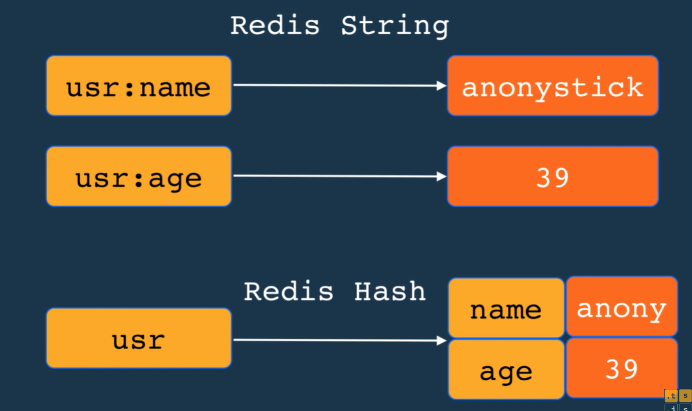
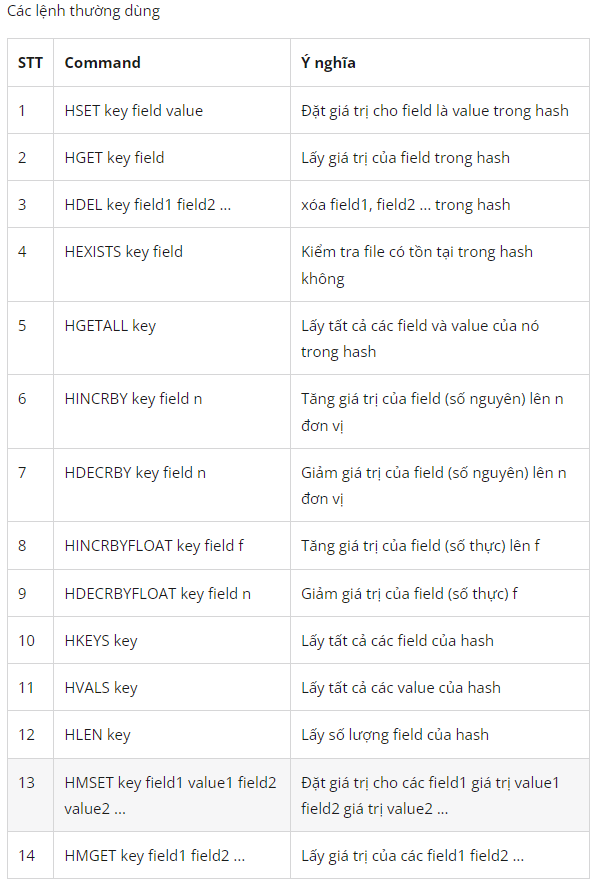
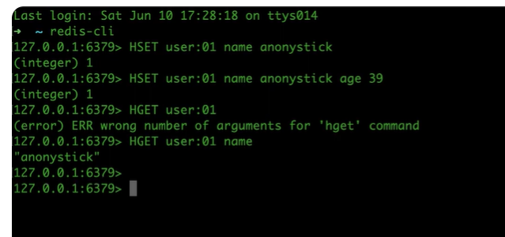
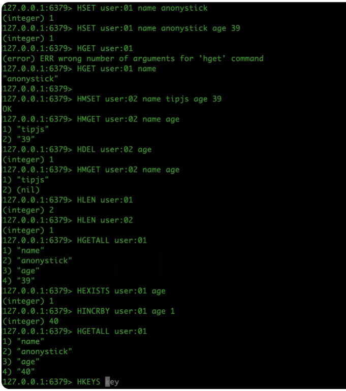
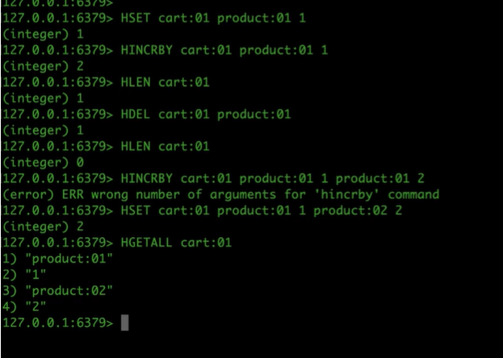
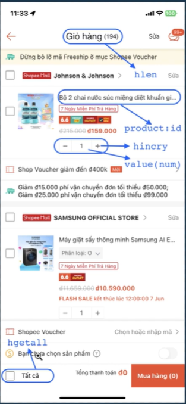

1. cấu trúc
- có thể dùng cache trong giỏ hàng hoặc làm giỏ hàng luôn ko cần cache
- 2^32

2. các lệnh phổ biến 
- HSET user:01 name my
- HMSET user:02 name tra age 22
- HMGET user:02 name age
- HDEL user:02 age 
- HLEN user:01 -> số phần tử 
- HLEN user:02 

- HGETALL user:01

3. khi nào dùng 

