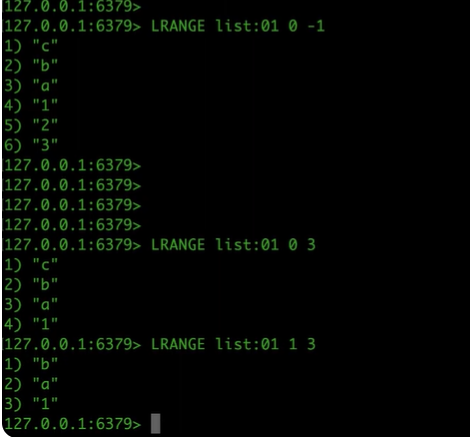
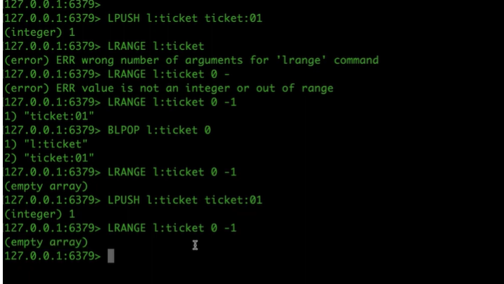

1. cấu trúc
- lưu các phần tử lặp lại đc
- Redis lists are linked lists of string values. Redis lists are frequently used to:
    - Implement stacks and queues.
    - Build queue management for background worker systems.

2. các lệnh phổ biến

- LPUSH adds a new element to the head of a list;
- RPUSH adds to the tail.
- LPOP removes and returns an element from the head of a list; RPOP does the same but from the tails of a list.
- LLEN returns the length of a list.
- LMOVE atomically moves elements from one list to another.
- LTRIM reduces a list to the specified range of elements.

- Lists support several blocking commands. For example:

    - BLPOP removes and returns an element from the head of a list. If the list is empty, the command blocks until an element becomes available or until the specified timeout is reached.
    - BLMOVE atomically moves elements from a source list to a target list. If the source list is empty, the command will block until a new element becomes available.

3. kịch bản sử dụng 
- chính là hàng đợi tin nhắn, bảo toàn thứ tự, xử lí tin nhắn trùng lặp, bảo mật
- producer push để chèn vào tin và hàng đợi, nếu key ko tồn tại thì sẽ có 1 hàng đợi trống và tn sẽ đc điền vô sau  , consumer người dùng dung lpop để lấy dữ liệu ra. tuy nhiên rùi ro  nếu prod di thì ko có thông báo cho client, muốn kịp thời phải dùng vong lặp -> UPU tiêu tốn trong cónumer nhiều , dungf bog laf chawn ddeens khi update xong 

