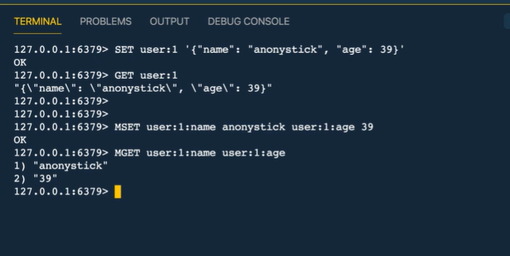

1. câú trúc
- có thể tối đa 512M
- SDS: Simple Dynamic Strings
- ko giống string trông c++, sds đc so sánh với chuổi góc của c chứ ko phải c++
- có 3 loại 
    + embstr : 44 byte dữ liệu
    + raw : > 44 byte
    + int : chỉ số

2. Các lệnh phổ biến 
- SET name my
- GET name
- EXISTS name -> tồn tại là 1, ko tồn tại là 0
- STRLEN name -> 2
- object encoding name -> emdstr
- DEL name -> 1 là thành công,  0 la fko thành công

- MSET key1 tra key2 my
- MGET key1 key2

- SET 001:like 0
- INCR 001:like 
- GET 001:like 
- INCRBY 001:like 9
- DECR 001:like 
- DECRBY 001:like 9

- tim kiếm 
    + KEYS '001*'
- set hêts hạn -> 60s hết hạn
    + EXPIRE name 60
- kt thời gian còn sống 
    + TTL name

- SET key value  EX 60
- SETNX key value1 -> key có rồi thì là ko set và kq là 1, chưa có thì set và kq là 0

3. kịch bản ứng dụng
- đa số sd về cache

